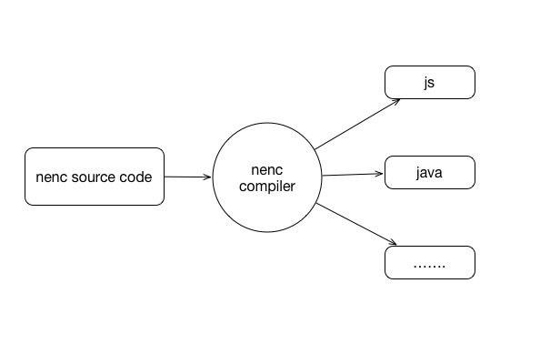

# nenc

A Simple Cross-Platform Easy-Hybrid Functional Language Which Compiled To Other Platform Languages, like javascript, java ...

Nenc project starts from a simple idea, I don't want to write almost the same logic code on so many different platforms like browser, android, ios, server.

## document site

[http://lovekino.github.io/project/nenc/index.html](http://lovekino.github.io/project/nenc/index.html)

## features

- It's easy to hybrid nenc code with host code. You can use config host files as libraries, and you also can embed nenc code to host code.

## goal

